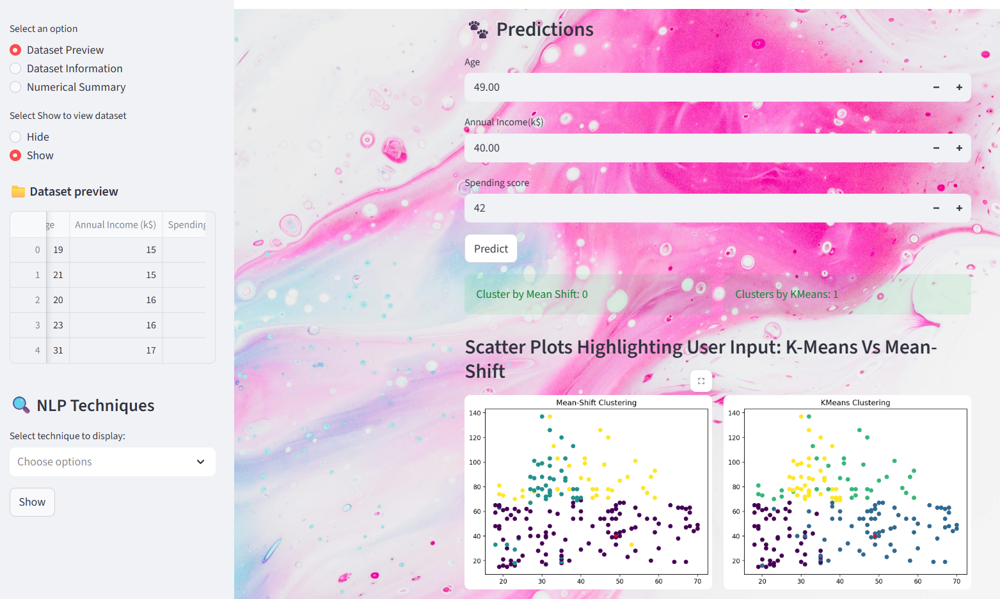

# Clustering Analysis Web Application
This project is a Machine Learning-based clustering web application that groups input data into clusters using unsupervised learning models.
This application includes user authentication, dataset preview, FAQ support, chatbot assistance, and interactive visualizations. users can input data points to identify with cluster they blelong to, and view graphical representations of clusters.
This project was developed as a learning project, and results may vary.

# Key Features
- User Authentication
- Dataset preview
- Chatbot Assistance
- FAQs Section
# clustering Model used: 
  K-Mean Clustering
  Mean Shift Clustering
---
# web app preview

